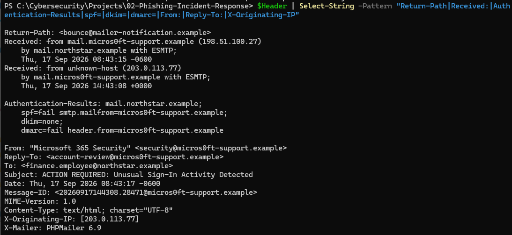
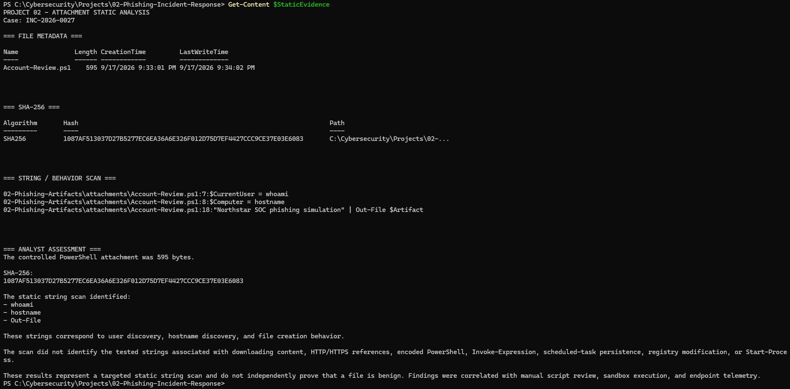
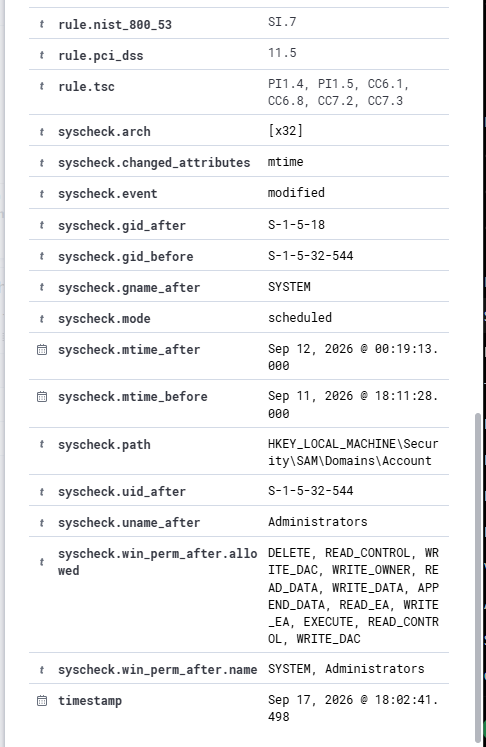
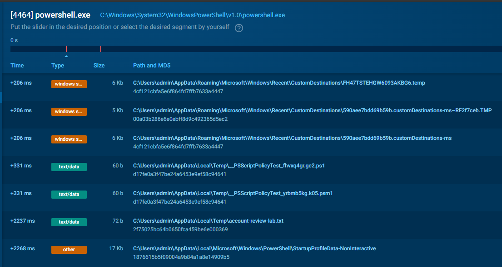
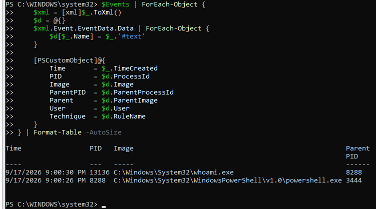
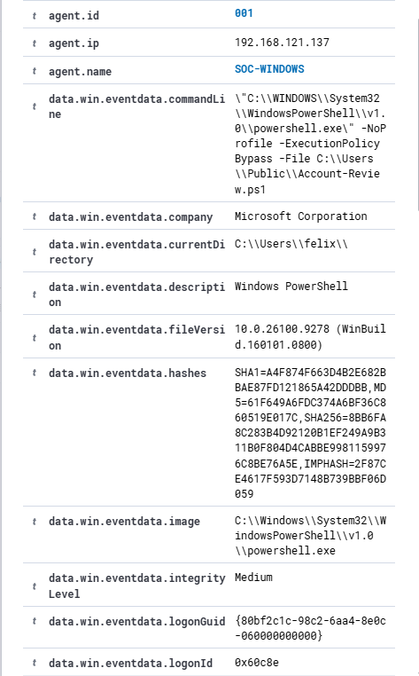
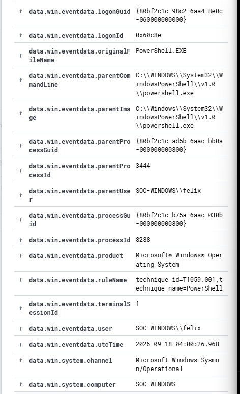
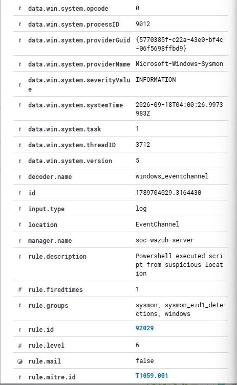
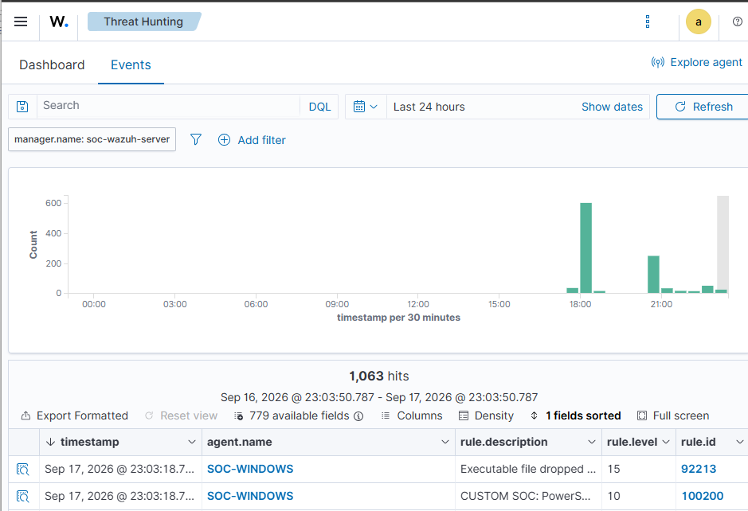

# Phishing Incident Response - SOC Investigation


A hands-on SOC investigation of a simulated phishing incident from initial email triage through endpoint investigation, SIEM correlation, incident response, and detection engineering.


This project demonstrates an evidence-driven workflow using a controlled Windows endpoint, Sysmon telemetry, Wazuh SIEM, sandbox analysis, PowerShell, threat-intelligence resources, and Sigma.


> All phishing infrastructure and potentially malicious artifacts used in the incident are simulated or controlled for educational purposes. No real users were targeted and no real malware was intentionally deployed.


---


## Project Overview


**Case ID:** INC-2026-0027  

**Environment:** Northstar Regional Services - fictional organization  

**Endpoint:** SOC-WINDOWS  

**Endpoint IP:** 192.168.121.137  

**SIEM:** Wazuh  

**Endpoint Telemetry:** Sysmon  

**Incident Type:** Simulated phishing / suspicious PowerShell execution


The investigation began with a simulated Microsoft 365 security email containing suspicious sender information and a defanged account-verification URL.


An associated controlled PowerShell attachment, `Account-Review.ps1`, was analyzed statically and in a sandbox before being executed on a monitored Windows 11 lab endpoint.


Sysmon captured the resulting process activity, Wazuh detected and correlated the execution, the artifacts were eradicated, recovery was verified, and additional Wazuh and Sigma detections were developed and tested.


---


## Investigation Workflow


```text

Phishing Email

      |

      v

Email + Header Analysis

      |

      v

IOC Extraction + Enrichment

      |

      v

Attachment Static Analysis

      |

      v

Sandbox Analysis

      |

      v

Controlled Endpoint Execution

      |

      v

Sysmon Telemetry

      |

      v

Wazuh Investigation

      |

      v

Incident Response

      |

      v

Detection Engineering

      |

      +----> Custom Wazuh Rule

      |

      +----> Sigma Rule

```


---


## Tools Used


| Tool | Purpose |
|---|---|
| PowerShell | Artifact analysis, IOC extraction, hashing, endpoint execution, and evidence collection |
| CyberChef | Safe URL refanging and analysis |
| VirusTotal | Threat-intelligence enrichment practice |
| URLhaus | Malicious URL intelligence analysis |
| ANY.RUN | Controlled dynamic attachment analysis |
| Sysmon | Windows process telemetry |
| Wazuh | SIEM investigation, alerting, hunting, and custom detection |
| Sigma CLI | Vendor-neutral detection-rule validation |
| VMware Workstation | Isolated virtualized lab environment |


---


## 1. Phishing Triage


The simulated email impersonated Microsoft 365 Security and attempted to create urgency around an alleged unusual sign-in.


Key findings included:


- Typosquatted `micros0ft` sender domain

- Sender and verification-link domain mismatch

- Different Return-Path

- SPF failure

- DMARC failure

- No DKIM authentication

- Urgent account-verification language


The email used a reserved `.example` domain and a defanged URL to keep the exercise safe.


### Header Analysis





Detailed artifacts:


- [Phishing email](02-Phishing-Artifacts/email/phishing-email.txt)

- [Email headers](02-Phishing-Artifacts/headers/phishing-headers.txt)

- [Initial triage](04-Investigation/initial-triage.md)

- [Header authentication analysis](07-Evidence/investigation-output/header-authentication-analysis.txt)


---


## 2. IOC Extraction and Analysis


PowerShell regular expressions were used to extract candidate:


- Email addresses

- Domains

- IPv4 addresses

- URLs


The results were manually reviewed to distinguish useful indicators from internal/context values and regex false positives.


Key simulated indicators included:


```text

security@micros0ft-support.example

account-review@micros0ft-support.example

micros0ft-support.example

login-microsoft365-security.example

203.0.113.77

198.51.100.27

hxxps://login-microsoft365-security.example/account/verify

```


Public threat-intelligence exercises were documented separately so unrelated real-world indicators were not falsely attributed to the simulated incident.


See:


- [IOC analysis](03-IOC-Analysis/iocs.md)

- [IOC enrichment](03-IOC-Analysis/ioc-enrichment.md)

- [Raw IOC extraction evidence](07-Evidence/investigation-output/email-ioc-extraction.txt)


---


## 3. Attachment Analysis


The controlled attachment was:


```text

Account-Review.ps1

```


SHA-256:


```text

1087AF513037D27B5277EC6EA36A6E326F012D75D7EF4427CCC9CE37E03E6083

```


Static analysis identified behavior including:


- Current-user discovery

- Hostname discovery

- Current-time retrieval

- Creation of a harmless temporary text file


Targeted static analysis did not identify tested strings associated with downloaders, encoded commands, `Invoke-Expression`, scheduled tasks, registry modification, or explicit network URLs.





See:


- [Controlled attachment](02-Phishing-Artifacts/attachments/Account-Review.ps1)

- [Static-analysis evidence](07-Evidence/investigation-output/attachment-static-analysis.txt)


---


## 4. Sandbox Analysis


The attachment was executed in a controlled ANY.RUN sandbox before endpoint testing.


Observed process behavior included:


```text

powershell.exe

    |

    +-- whoami.exe

    |

    +-- HOSTNAME.EXE

```


The sandbox also showed creation of:


```text

account-review-lab.txt

```


No HTTP requests, process network connections, or network threats were reported for the PowerShell execution.








---


## 5. Endpoint Investigation


The attachment hash was verified before controlled execution on `SOC-WINDOWS`.


Execution command:


```powershell

powershell.exe -NoProfile -ExecutionPolicy Bypass -File C:\Users\Public\Account-Review.ps1

```


Sysmon Event ID 1 recorded the PowerShell execution.


Observed PowerShell process:


```text

PID:       8288

User:      SOC-WINDOWS\felix

Integrity: Medium

```


Sysmon subsequently recorded:


```text

powershell.exe

      |

      +-- whoami.exe

```


The parent/child process relationship directly correlated `whoami.exe` with the controlled PowerShell execution.





Raw evidence:


- [Relevant Sysmon process events](07-Evidence/logs/project02-sysmon-process-events.txt)

- `07-Evidence/logs/project02-sysmon.evtx` - preserved native Sysmon Operational log


---


## 6. Wazuh SIEM Investigation


Structured hunting in Wazuh was used to locate the original execution:


```text

data.win.eventdata.commandLine : *Account-Review.ps1*

```


The corresponding event generated:


```text

Rule ID:     92029

Level:       6

Description: Powershell executed script from suspicious location

MITRE:       T1059.001 - PowerShell

```


Broad free-text searches initially produced unrelated results. Searching the structured command-line field provided precise correlation.











---


## 7. MITRE ATT&CK Mapping


| Technique | Tactic | Evidence |
|---|---|---|
| T1059.001 - PowerShell | Execution | PowerShell executed the controlled attachment using `-ExecutionPolicy Bypass` |
| T1033 - System Owner/User Discovery | Discovery | `whoami.exe` executed as a child of the PowerShell process |


No additional ATT&CK techniques are claimed without supporting evidence.


---


## 8. Incident Response


### Evidence Preservation


Before eradication:


- Attachment SHA-256 was verified.

- Relevant Sysmon events were exported.

- Native Sysmon EVTX evidence was preserved.

- Process relationships and command lines were documented.

- SIEM evidence was captured.


### Eradication


The controlled artifacts were removed:


```text

C:\Users\Public\Account-Review.ps1

C:\Users\felix\AppData\Local\Temp\account-review-lab.txt

```


Post-removal `Test-Path` checks returned:


```text

False

False

```


### Recovery


Recovery verification confirmed:


```text

Sysmon64   Running   Automatic

WazuhSvc   Running   Automatic

```


Connectivity was also verified:


```text

SOC-WINDOWS:   192.168.121.137

Wazuh Manager: 192.168.121.10

TCP Port:      1514

Result:        Successful

```


Network isolation was not performed because the endpoint was part of a controlled lab and no malicious network communication was observed.


See:


- [Incident response record](06-Response/incident-response.md)

- [Recovery verification evidence](07-Evidence/investigation-output/project02-recovery-verification.txt)


---


## 9. Detection Engineering


The investigation was extended into detection engineering.


### Custom Wazuh Rule


A custom Wazuh rule was created to identify PowerShell execution containing:


```text

-ExecutionPolicy Bypass

```


Detection:


```text

Rule ID:     100200

Level:       10

Description: CUSTOM SOC: PowerShell executed with ExecutionPolicy Bypass

MITRE:       T1059.001

```


The configuration passed Wazuh validation and a fresh controlled PowerShell test successfully triggered rule `100200`.





The live rule was exported from the Wazuh manager and preserved:


- [Wazuh rule 100200](05-Detection/wazuh-rules/project02-wazuh-rule-100200.xml)

- [Detection engineering notes](05-Detection/detection-rule.md)


### Sigma Detection


A vendor-neutral Sigma rule was created for the same behavioral characteristic.


- [Sigma rule](05-Detection/sigma/powershell-execution-policy-bypass.yml)

- [Sigma validation evidence](07-Evidence/investigation-output/sigma-rule-validation.txt)


Sigma CLI validation returned:


```text

0 errors

0 condition errors

0 validation issues

```


`ExecutionPolicy Bypass` can occur during legitimate administration and automation, so production deployment would require appropriate tuning and allowlisting.


---


## Key Findings


The investigation established that:


- The simulated email contained multiple phishing indicators.

- Candidate IOCs required analyst validation rather than blind regex classification.

- The controlled PowerShell artifact matched its expected SHA-256 before endpoint execution.

- Sandbox and endpoint behavior were consistent with the reviewed script.

- Sysmon captured detailed process telemetry.

- Wazuh successfully detected and correlated the PowerShell execution.

- Structured SIEM hunting was more precise than broad free-text searching.

- Controlled artifacts were successfully eradicated.

- Monitoring and SIEM connectivity remained operational after eradication.

- Custom Wazuh and Sigma detections were developed from observed behavior.


No evidence from the controlled exercise established credential theft, persistence, privilege escalation, lateral movement, command-and-control communication, or data exfiltration.


---


## Evidence


The repository contains supporting technical evidence under [`07-Evidence`](07-Evidence/), including:


```text

investigation-output/

    attachment-static-analysis.txt

    email-ioc-extraction.txt

    header-authentication-analysis.txt

    project02-recovery-verification.txt

    sigma-rule-validation.txt


logs/

    project02-sysmon-process-events.txt

    project02-sysmon.evtx


screenshots/

    attachment-static-analysis.png

    email-header-analysis.png

    sandbox-modified-files.png

    sandbox-process-tree.png

    sysmon-process-events.png

    wazuh-account-review-alert-rule.png

    wazuh-account-review-commandline.png

    wazuh-account-review-process-details.png

    wazuh-custom-rule-100200.png

```


---


## Repository Structure


```text

01-Scenario/

02-Phishing-Artifacts/

03-IOC-Analysis/

04-Investigation/

05-Detection/

06-Response/

07-Evidence/

08-Final-Report/

```


Full investigation report:


[Phishing Incident Response Report](08-Final-Report/incident-report.md)


---


## Skills Demonstrated


- Phishing email triage

- Email-header analysis

- IOC extraction and validation

- Threat-intelligence enrichment

- PowerShell static analysis

- File hashing and integrity verification

- Malware sandbox analysis

- Windows endpoint investigation

- Sysmon telemetry analysis

- SIEM alert investigation

- Structured Wazuh hunting

- Process-tree correlation

- Evidence preservation

- Incident containment and eradication

- Recovery validation

- MITRE ATT&CK mapping

- Wazuh detection engineering

- Sigma rule development and validation


---


## Project Outcome


This project demonstrates an end-to-end, evidence-driven SOC workflow:


**Phishing Triage -> Artifact Analysis -> Sandbox -> Endpoint Telemetry -> SIEM Investigation -> Incident Response -> Detection Engineering**


Rather than assuming compromise from the phishing scenario, technical conclusions were limited to behavior supported by collected evidence.


